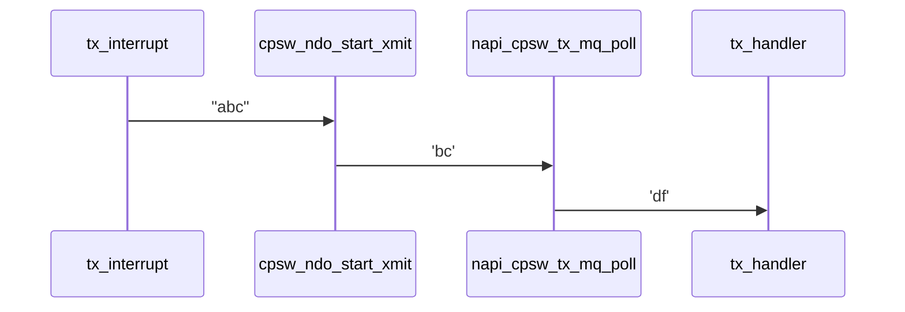

# rust ethernet driver

```mermaid
sequenceDiagram
    participant tx_int as tx_interrupt
    participant xmit as cpsw_ndo_start_xmit
    participant napi as napi_cpsw_tx_mq_poll
    participant tx_handler
    tx_int ->> xmit : "abc"
    xmit ->> napi : 'bc'
    napi ->> tx_handler : 'df'
```
